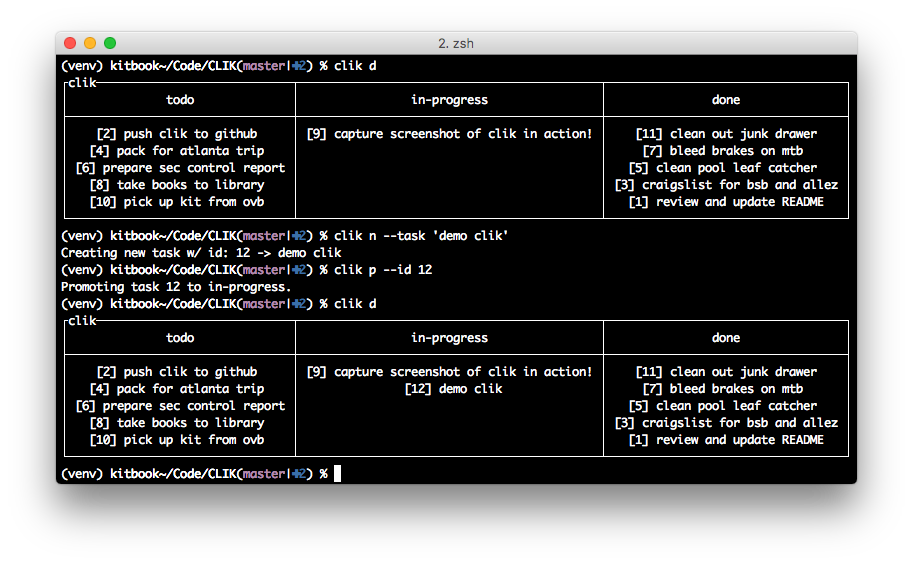

# clikan: CLI (Personal) Kanban
There has been a little chatter about 'personal' kanban on the tubes lately.  I don't know about the need to hype it as personal, but if you're looking to get your head wrapped around stuff needing to get done - then kanban is a healthy tool.  clikan is a super simple command-line utility for tracking tasks following the Japanese Kanban (boarding) style.  clikan's core intent is to be easy to use, and to maintain simplicity.


## Installation

$`pip install clikan`

### Create a `.clikan.yaml` in your $HOME directory

```yaml
---
clikan_data: /Users/kplummer/.clikan.dat
limits:
  todo: 10
  wip: 3
  done: 10
```

* `clikan_data` is the datastore file location.
* `limits:todo` is the max number of items allowed in the todo column, keep this small - you want a smart list, not an ice box of ideas here.
* `limits:wip` is the max number of items allowed in in-progress at a given time.  Context-switching is a farce, focus on one or two tasks at a time.
* `limits:done` is the max number of done items visible, they'll still be stored.  It's good to see a list of done items, for pure psyche.

-- or --

$`clikan configure`

to create a default data file location.

This is where the tool will store the history of files.  It's configurable so you can put the data in a Dropbox or other cloud-watched directory for safe archiving/backing up.

If you're like me, even `clikan` is a bunch too many characters to type, so shorten with an alias in my shell config to `clik`.

## Usage
The basic usage of clikan breaks down into three basic commands:

### Show

$`clikan show` (alias: s)

### Add

$`clikan add [task text]` (alias: a)

### Promote

$`clikan promote [task id]` (alias: p)

And there are more supporting commands:

### Regress

$`clikan regress [task id]`

### Delete

$`clikan delete [task id]`

### Configure

$`clikan configure`

### Screenshot



## Development

It's Python code.  Fork, fix, and submit a PR - it'd be super appreciated.

Tests?  Um, yeah.

### Testing

Updated test suite to include 3.6-3.9 on Windows, macOS and Ubuntu.

***Definitely*** need some help here.  There is a basic test suite available in `clikan_test.py`.

To run it, make sure ~/.clikan.dat is empty, the you can run:

```
pytest clikan_test.py
```

If you don't want to whack your **working** version of clikan you do this:

```
CLIKAN_HOME=/tmp pytest clikan_test.py
```

## License

MIT License

Copyright 2018 Kit Plummer

Permission is hereby granted, free of charge, to any person obtaining a copy of this software and associated documentation files (the "Software"), to deal in the Software without restriction, including without limitation the rights to use, copy, modify, merge, publish, distribute, sublicense, and/or sell copies of the Software, and to permit persons to whom the Software is furnished to do so, subject to the following conditions:

The above copyright notice and this permission notice shall be included in all copies or substantial portions of the Software.

THE SOFTWARE IS PROVIDED "AS IS", WITHOUT WARRANTY OF ANY KIND, EXPRESS OR IMPLIED, INCLUDING BUT NOT LIMITED TO THE WARRANTIES OF MERCHANTABILITY, FITNESS FOR A PARTICULAR PURPOSE AND NONINFRINGEMENT. IN NO EVENT SHALL THE AUTHORS OR COPYRIGHT HOLDERS BE LIABLE FOR ANY CLAIM, DAMAGES OR OTHER LIABILITY, WHETHER IN AN ACTION OF CONTRACT, TORT OR OTHERWISE, ARISING FROM, OUT OF OR IN CONNECTION WITH THE SOFTWARE OR THE USE OR OTHER DEALINGS IN THE SOFTWARE.

## Support

Github Issues
https://github.com/kitplummer/clikan/issues

Feel free to use issues as a forum-like thing too, ask questions or post comments.
